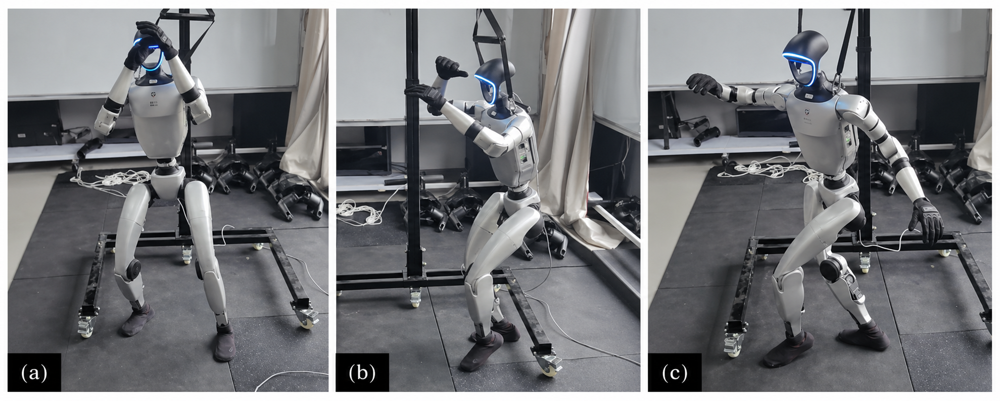

# G1 23DoF 混合动作策略工程

本项目面向 Unitree G1 23DoF，提供一套本地化的训练、动作资产管理、仿真回放和部署交接工程。项目默认聚焦两条策略线：

- `Unitree-G1-23Dof-Flat`：基础速度跟踪，用于稳定行走能力训练。
- `Unitree-G1-23Dof-Tracking`：动作跟踪 / mimic，用于参考动作模仿训练。

项目把训练引擎、动作资产、策略注册表、MuJoCo 回放、部署侧仿真和交接检查统一到一个顶层 CLI 中，避免训练脚本、模型产物和部署配置散落在多个目录里。



## 项目核心

```text
G1 23DoF 动作资产
  -> 基础速度策略训练
  -> 动作跟踪策略训练
  -> MuJoCo 回放验证
  -> 部署侧仿真与控制器检查
```

默认动作资产：

```text
engines/base_locomotion/src/assets/motions/g1_23dof/jilejingtu.npz
```

项目运行时会把它准备到：

```text
runtime/example_motion/example_motion.npz
```

## 快速开始

创建 Conda 环境：

```bash
conda env create -f environment.yml
conda activate g1-23dof
```

检查项目注册表和路径：

```bash
python -m cli status
python -m cli check-paths
```

准备默认动作资产：

```bash
python -m cli workflow --config configs/workflows/example_training.yaml --execute --stages motion
```

训练速度跟踪策略：

```bash
python -m cli train-velocity
```

训练动作跟踪策略：

```bash
python -m cli train-tracking
```

回放训练好的 checkpoint：

```bash
python -m cli play-velocity --checkpoint engines/base_locomotion/logs/rsl_rl/.../model_1000.pt
python -m cli play-tracking --motion-file runtime/example_motion/example_motion.npz --checkpoint engines/base_locomotion/logs/rsl_rl/.../model_1000.pt
```

构建并运行部署侧仿真：

```bash
python -m cli build-sim
python -m cli sim-stack --network lo
```

任何训练或仿真命令都可以先加 `--dry-run` 查看真实生成的 WSL 命令：

```bash
python -m cli train-tracking --dry-run
python -m cli sim-stack --dry-run
```

## 文档

- [安装与环境](docs/installation.md)：Conda、Python 包、WSL、CUDA、build-sim 原生依赖。
- [训练说明](docs/training.md)：速度跟踪、动作跟踪、动作资产和 checkpoint。
- [仿真说明](docs/simulation.md)：MuJoCo 回放、ONNX 回放、build-sim、sim-stack。
- [部署说明](docs/deployment.md)：策略放置、控制器构建、网络模式和交接检查。
- [工程架构](docs/architecture.md)：项目分层、注册表设计、适配层和训练引擎边界。

## 目录结构

```text
contracts/   动作资产、策略产物、关节语义和部署交接的数据契约。
adapters/    motion、velocity policy、tracking policy 的本地适配层。
engines/     集成的 G1 23DoF 训练、回放和部署侧仿真引擎。
pipelines/   项目级动作处理和部署交接检查入口。
registry/    动作资产、训练任务、策略产物注册表。
configs/     示例 workflow、task、policy 和部署交接配置。
runtime/     本地生成的动作资产、编排报告和日志。
docs/        安装、训练、仿真、部署和架构文档。
tests/       CLI 与 registry 回归测试。
```

## 验证

```bash
python -m cli check-paths
python -m unittest tests.test_cli_smoke tests.test_registry_manager
```

测试只验证命令接线和注册表语义。长时间训练、仿真编译和实机部署仍依赖本机 WSL、GPU、Unitree SDK2 和 CycloneDDS 环境。
